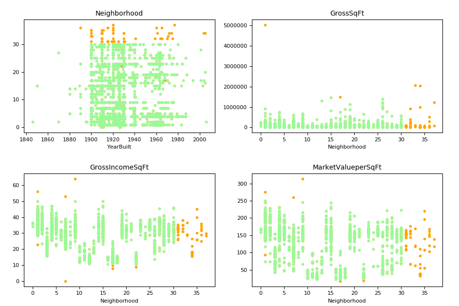

## Machine Learning for Cities: Assignment 2
New York University [CUSP-GX-5006]  
Instructor: Professor Luis Gustavo Nonato  
Written by: Viola Zhong & Dror Ayalon

### Installing dependencies  
**Method 1: Using 'requirements.txt':**

It is possible to install all relevant dependencies using a python virtual machine and the requirements.txt file:

1. (in case you do not have the virtual machine package installed for python3) Installing the virtual environment package:  
``$ pip3 install virtualenv``

1. Setting up a virtual machine (**while you're on the project folder**):  
``$ virtualenv env``

1. Loggin in the virtual machine  
``$ pip3 install -r requirements.txt``

**Method 2: Installing manually:**  
In case where the method shown above doesn't work, just install the relevant packages manually:

1. Install numpy  
``$ pip3 install numpy``

1. Install scipy  
``$ pip3 install scipy``

1. Install matplotlib  
``$ pip3 install matplotlib``

1. Install scikit-learn  
``pip install -U scikit-learn``  

👍

### File structure
- All python3 scripts are in the main folder.
  - `clean_split.py` - Does the following operations:
    - opens `manhattan-dof.csv`
    - removes outliers from the data
    - splits the data into training and validation datasets
    - outputs `training.csv` and `validation.csv` to the `clean_datasets` folder.
- [folder] ``plots`` - includes all plot images.
  - [folder] ``data_cleaning`` - plots images that shows the cleaned data (before vs. after)

### Progress
The data was cleaned from outliers. The cleaned data (in green) can be seen below:

