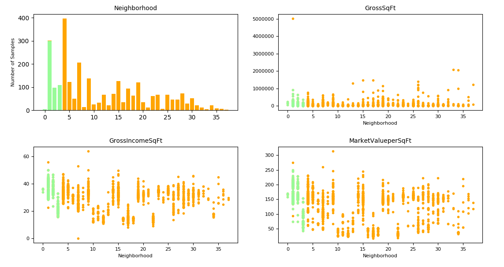

## Machine Learning for Cities: Assignment 2
New York University [CUSP-GX-5006]  
Instructor: Professor Luis Gustavo Nonato  
Written by: Viola Zhong & Dror Ayalon

### Installing dependencies  
**Method 1: Using 'requirements.txt':**

It is possible to install all relevant dependencies using a python virtual machine and the requirements.txt file:

1. (in case you do not have the virtual machine package installed for python3) Installing the virtual environment package:  
``$ pip3 install virtualenv``

1. Setting up a virtual machine (**while you're on the project folder**):  
``$ virtualenv env``

1. Loggin in the virtual machine  
``$ pip3 install -r requirements.txt``

**Method 2: Installing manually:**  
In case where the method shown above doesn't work, just install the relevant packages manually:

1. Install numpy  
``$ pip3 install numpy``

1. Install scipy  
``$ pip3 install scipy``

1. Install matplotlib  
``$ pip3 install matplotlib``

1. Install scikit-learn  
``pip install -U scikit-learn``  

👍

### File structure
- All python3 scripts are in the main folder.
  - `clean_split.py` - Does the following operations:
    1. opens `manhattan-dof.csv`
    - removes outliers from the data
    - splits the data into training and validation datasets
    - normalizes the data. we have the code for 2 methods: using `whiten` (commented out in the code), and using the maximum value (which is currently in use)
    - outputs 'ready-to-use' CSV files to the `clean_datasets` folder (see details about each file below).

- [folder] ``plots`` - includes all plot images, separated by experiment.

- [folder] ``clean_datasets`` - includes the following csv files (that can be generated by `clean_split.py`):
  - `x_training.csv` - normalized training set (x)
  - `y_training.csv` - classification training data (y)
  - `x_test.csv`- normalized test set (x)
  - `y_test.csv`- classification test data (y)

### Results
#### Data cleaning
The data was cleaned from outliers. The cleaned data (in green) can be seen below:

Unfortunately, it seems like at the moment the classification algorithms do not do a good job in classifying our data into 30 classes:

I assumes that this is probably because the data set (number of samples on the training set) is too small for so many classes.

I tried to clean the data again, and to leave only 10 classes (which means, 10 neighborhoods):

The results were a bit better, but not by much:

When I reduce the data set to 3 neighborhoods only:

The classification works relatively well well:

### What's next?
- Start to write the report using Pages!
- Look at the results and see if there's a way to improve them, or if I did something wrong.
- Try to play with the code and maybe to find a combination that will make the results more interesting.

🍹🍹
